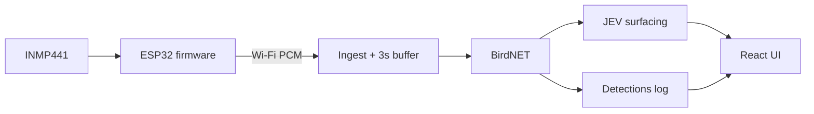

# Wildlife Observer

A personal balcony/window **wildlife listener**: ESP32 + INMP441 mic streams audio over Wi‑Fi to your Mac, **BirdNET** identifies birds, **JEV** decides what deserves the big “visitor” moment, and a mobile **React** app shows each bird as an animated **Rive** card, plus an hourly radar and a logbook of everything heard.

How the whole system fits together, from microphone to app (including wiring): **[architecture.md](architecture.md)**.

---

## Architecture

```text
  REAL WORLD (birds, traffic, room noise)
           │
           ▼
    ┌──────────────┐
    │   ESP32      │  I2S mic, 16 kHz mono, ~1 s HTTP chunks
    │  + INMP441   │  Wi‑Fi only (USB = power / flash / serial)
    └──────┬───────┘
           │  POST /api/ingest/audio  (+ heartbeat)
           ▼
    ┌──────────────┐
    │   Backend    │  Buffer 3 s → WAV → BirdNET → history + JEV
    │   (FastAPI)  │  JSONL on disk, SSE to UI
    └──────┬───────┘
           │  REST + EventSource
           ▼
    ┌──────────────┐
    │   Frontend   │  Scan (Rive cards), Radar, Logbook
    │ (React+Rive) │  phone browser on the LAN
    └──────────────┘
```



---

## What each part does

| Part | Location | Responsibility |
|------|----------|----------------|
| **INMP441** | Hardware | Digital MEMS mic; I²S to ESP32 (see [architecture.md](architecture.md)). |
| **ESP32 firmware** | `src/`, `include/` | Wi‑Fi, read mic at **16 kHz mono**, send **~1 s** PCM chunks to the backend, periodic heartbeat. Does **not** run BirdNET or store birds. |
| **Ingest** | `backend/app/main.py` | Accepts PCM; accumulates until **3 s** of audio per device. |
| **Segment WAV** | `backend/data/recordings/` | Saves `{uuid}.wav` (16 kHz) and `{uuid}_48k.wav` for analysis. |
| **BirdNET** | `backend/app/birdnet_runner.py` | Species + confidence on each 3 s window; geo filter (Bengaluru by default). |
| **Event processor** | `backend/app/event_processor.py` | Writes **detections** to history; optionally creates a **surfaced event** for the hero. |
| **JEV** | `backend/app/jev_client.py` | When enabled, asks TypeSafe **Jev** whether to interrupt the UI (species already fixed by BirdNET). |
| **Store** | `backend/app/store.py` | In-memory + `detections.jsonl` / `events.jsonl`; species summaries. |
| **Species photos** | `backend/app/species_images.py` | Wikipedia thumbnail first, iNaturalist (reusable CC licences) as fallback; cached with photo credits. |
| **Frontend** | `frontend/` | Mobile UI: **Scan** (Rive animal card per species), **Radar** (calls per hour), **Logbook** (grid + filters). See [frontend/README.md](frontend/README.md). |
| **Rive card** | `frontend/public/rive/animal-card.riv` | Built from the Rive CLI project `~/Documents/rive-cli/animal-card`; photo, names and colour scheme are bound at runtime. |

BirdNET **identifies**; JEV **judges attention**. JEV never changes the species label.

---

## Thresholds (the important tables)

Settings live in **`backend/.env`** (copy from [`backend/.env.example`](backend/.env.example)). Restart **uvicorn** after changes.

### Logging threshold — what gets saved

Controls which BirdNET hits become **detections** (bird log cards + JSONL). Also controls **WAV retention**.

| Env variable | Default (project) | Meaning |
|--------------|-------------------|---------|
| **`BIRDNET_MIN_CONF`** | **0.20** | Minimum BirdNET confidence to accept a species for this segment. Below → **no detection**, **WAVs deleted**. |
| **`BIRDNET_USE_GEO`** | `true` | Drop species unlikely near `BIRDNET_LAT` / `BIRDNET_LON`. |
| **`ANALYSIS_WINDOW_SECONDS`** | **3** | Seconds of audio buffered before one BirdNET run (BirdNET-friendly; fast UI). |

**WAV files:** For each 3 s segment, both `.wav` and `_48k.wav` are removed automatically if BirdNET returns **no** species above `BIRDNET_MIN_CONF`. If anything is logged, those files are **kept** for playback on the card (hero thresholds do not delete them).

### Hero / “Noticed” threshold — what interrupts the UI

Logging and surfacing are **separate**. Many detections can exist without the big visitor animation.

| Env variable | Default (project) | Meaning |
|--------------|-------------------|---------|
| **`MIN_CONFIDENCE`** | **0.35** | Hard floor before hero/JEV is considered. Below → no surfaced event (log may still have the row if ≥ `BIRDNET_MIN_CONF`). |
| **`EVENT_COOLDOWN_SECONDS`** | **300** | Same species cannot surface again within 5 minutes. |
| **`JEV_MODE`** | **`llm`** | `rules` = simple heuristics; `llm` = TypeSafe Jev API (needs key). |
| **`JEV_SURFACE_THRESHOLD`** | **0.55** | In LLM mode: Jev “yes” probability must be ≥ this (and not classified as a routine repeat). |
| **`TYPESAFE_API_KEY`** | (your `.env`) | Jev API key; see [backend/README.md](backend/README.md). |

On Jev API failure, surfacing **falls back** to rule-based behavior for that segment.

### Quick reference — what each threshold affects

| Threshold | Bird log | Hero / SSE | WAV kept |
|-----------|----------|------------|----------|
| `BIRDNET_MIN_CONF` | ✅ | — | ✅ if logged |
| `MIN_CONFIDENCE` | — | ✅ | — |
| `JEV_*` (LLM mode) | — | ✅ | — |
| `EVENT_COOLDOWN_SECONDS` | — | ✅ | — |

### Call labels in the app

The app never shows BirdNET's raw score. Every logged call gets one of three labels instead:

| Label | BirdNET score | What it tells the user | Colour in the app |
|-------|---------------|------------------------|-------------------|
| **Clear Call** | **≥ 0.85** | Loud and unmistakable | mint |
| **Likely** | **0.60 to under 0.85** | Probably this bird | yellow |
| **Faint** | **under 0.60** (down to the logging floor) | Distant or partly masked — could be a lookalike | grey |

These are **display-only**, set in `confidenceTier` in [`frontend/src/utils/detections.ts`](frontend/src/utils/detections.ts). They don't change what is logged or surfaced — that is still `BIRDNET_MIN_CONF` and `MIN_CONFIDENCE` above.

---

## Continued example: one afternoon on the balcony

**Setup:** ESP32 on the sill, Mac on the same Wi‑Fi running backend (`0.0.0.0:8000`) and frontend (`npm run dev`). `BACKEND_HOST` in `include/config.h` points at the Mac’s LAN IP.

**08:00 — Quiet room**

- ESP32 sends ~1 s of PCM every second. Backend fills a **3 s** buffer.
- BirdNET hears mostly room tone; nothing ≥ **0.20** → **no log row**, **WAVs deleted**. UI stays on “Listening…”.

**08:04 — House Crow calls outside (strong)**

1. Buffer fills; backend saves `abc123.wav` + `abc123_48k.wav`.
2. BirdNET: *House Crow* **0.52** (above **0.20**) → up to 5 top species rows appended to **`detections.jsonl`**; WAVs **kept**.
3. **0.52 ≥ MIN_CONFIDENCE (0.35)** and cooldown clear → **JEV** gets context: species, confidence, past crow count, etc.
4. Jev returns high “surface” score → **WildlifeEvent** with `jev_reason` like `jev: confident detection (p=0.72)`.
5. UI: the crow's card moves to the top of **Scan**, the status pill says “Heard a House Crow!”, and the surfaced event pops a “Bird found!” toast.

**08:06 — Same crow, weaker slice**

- BirdNET: *House Crow* **0.22** → **logged** (≥ **0.20**), WAVs kept.
- **0.22 < MIN_CONFIDENCE (0.35)** → **no hero / Noticed**; JEV is not asked for surfacing.
- In the app this call shows as **Faint** (users see Clear Call / Likely / Faint, never the score); the expand icon on the Scan pill opens the species sheet with the full call log.

**08:07 — Another strong crow (within 5 minutes)**

- **0.48**, logged, passes **0.35**, but **within 5 min** of last surface → **cooldown** blocks hero. Still logged.

**08:12 — First time Rose-ringed Parakeet flies past**

- BirdNET **0.53**, logged. First species in your log → JEV often surfaces with `new species for you`.
- Hero plays again; Scan and Logbook get a new card for *Parakeet*.

**08:15 — Phone plays a European owl clip**

- BirdNET might score *Tawny Owl* high on audio alone, but **`BIRDNET_USE_GEO`** drops non-local species → **no prediction** → **WAVs deleted**, nothing in log.

**09:00 — You open Logbook**

- One card per species, sorted by recency (or Most heard / A–Z), filterable by call quality and date range; tap a card for its call log.

That loop runs 24/7 while the ESP32 streams and the backend stays up.

**Construction / loud noise:** High **rms** on `/api/status` → `last_segment` with `logged: false` is normal — BirdNET often finds no bird in noisy 3 s windows even when you hear calls outside.

---

## ESP32 — what it does and does not do

| Does | Does not |
|------|----------|
| Connect to **2.4 GHz** Wi‑Fi (`include/secrets.h`) | Run BirdNET or JEV |
| Sample mic **16 kHz**, mono | Store detection history |
| POST raw PCM to `http://<BACKEND_HOST>:8000/api/ingest/audio` | Use USB for audio (USB = power / flash only) |
| Send **heartbeat** (mic/Wi‑Fi OK) | Need reflashing when you change thresholds (backend only) |

Chunk size: **~1 s** of samples per upload (`SAMPLES_PER_CHUNK` in `include/config.h`). The backend, not the ESP32, decides the **3 s** analysis window.

---

## Data on disk (gitignored)

| Path | Contents |
|------|----------|
| `backend/data/history/detections.jsonl` | Every logged detection |
| `backend/data/history/events.jsonl` | Surfaced “visitor” events |
| `backend/data/history/image_cache.json` | Species photo URLs and credits (versioned; rebuilt automatically when the lookup changes) |
| `backend/data/recordings/*.wav` | Clips for logged segments only (orphans auto-deleted) |

---

## Run locally

**Backend**

```bash
cd backend
python3 -m venv .venv && source .venv/bin/activate
pip install -r requirements.txt
cp .env.example .env   # edit Wi‑Fi/BirdNET/JEV as needed
uvicorn app.main:app --host 0.0.0.0 --port 8000
```

**Frontend**

```bash
cd frontend && npm install && npm run dev
```

Open **http://localhost:5173** on the Mac (shown inside a phone frame), or **http://<mac-lan-ip>:5173** on your phone. The UI talks to port **8000** on the same host.

**ESP32:** [architecture.md](architecture.md) — set `BACKEND_HOST`, copy `secrets.example.h` → `secrets.h`, `pio run -t upload`.

**Health check**

```bash
curl -s http://127.0.0.1:8000/api/status | python3 -m json.tool
```

Shows BirdNET mode, analysis window, thresholds, `jev_active`, and **`last_segment`** (peak, rms, last log attempt).

---

## Repo layout

| Path | Purpose |
|------|---------|
| `src/`, `include/`, `platformio.ini` | ESP32 firmware |
| `backend/` | FastAPI + BirdNET + JEV |
| `frontend/` | React mobile UI (Rive card in `frontend/public/rive/`) |
| `architecture.md` | The whole system in brief: hardware → backend → JEV → app |
| `plan.md` | Product roadmap (local; gitignored) |

---

## Tuning tips

Current defaults: **`BIRDNET_MIN_CONF=0.20`**, **`MIN_CONFIDENCE=0.35`**, **`JEV_SURFACE_THRESHOLD=0.55`**.

- **Too many log lines:** raise `BIRDNET_MIN_CONF` (e.g. **0.25**).
- **Too many heroes / Noticed badges:** raise `MIN_CONFIDENCE` (e.g. **0.40**) and/or `JEV_SURFACE_THRESHOLD`; keep `JEV_MODE=llm`.
- **Too quiet / missing birds:** lower `BIRDNET_MIN_CONF` slightly or try `ANALYSIS_WINDOW_SECONDS=6` (restart backend).
- **Too slow to react:** keep `ANALYSIS_WINDOW_SECONDS=3` (project default).
- **Old WAV clutter:** only new segments auto-delete; prune `backend/data/recordings/` manually once if needed.

More backend detail: **[backend/README.md](backend/README.md)**.
